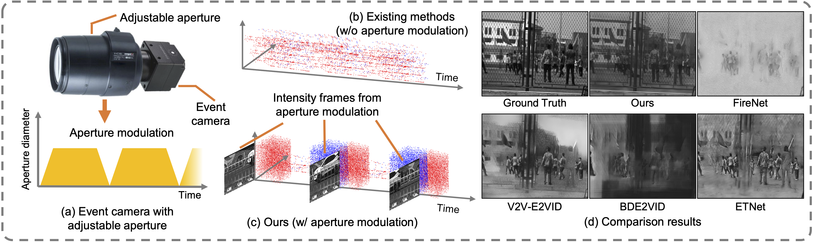
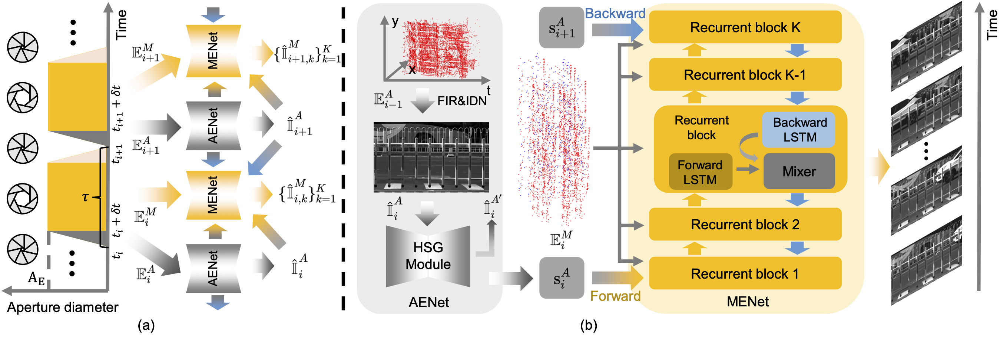

# [CVPR 2026] AE2VID: Event-based Video Reconstruction via Aperture Modulation

This is the official code for the paper "AE2VID: Event-based Video Reconstruction via Aperture Modulation" by [Chenxu Bai](https://a1henu.github.io)\*, [Boyu Li](https://liboyu02.github.io)\*, [Peiqi Duan](https://peiqi-duan.github.io)\#, Xinyu Zhou, [Hanyue Lou](https://hylz-2019.github.io) and [Boxin Shi](https://camera.pku.edu.cn)\#. 



## Overview

AE2VID reconstructs high-speed videos by jointly using aperture-modulation-triggered events and motion-triggered events.



The pipeline contains two subnetworks:

- **AENet** reconstructs dense aperture references from aperture-opening events. It uses FIR to estimate an initial reference image from first-positive-event timing, IDN/SwinIR to denoise the reference image, and HSG to map the aperture reference into recurrent hidden states.
- **MENet** reconstructs intermediate frames from motion-triggered event voxels with a bidirectional E2VID-style recurrent model and a pixel-wise mixer.

The aperture-closing interval is discarded in the reconstruction pipeline and can optionally be filled with RIFE interpolation.

## Installation

This project uses [uv](https://docs.astral.sh/uv/) for dependency management.
The default `pyproject.toml` uses CUDA 12.1 PyTorch wheels.

```bash
uv sync
```

## Checkpoints

Large checkpoint files are not tracked by git. Place external checkpoints under `pretrained/` or pass their paths with command-line arguments.

You can download checkpoints from the [Google Drive](https://drive.google.com/drive/folders/1uJi47bzALBsfb-Szwm_YuebFhuGnmAa3?usp=share_link):

```text
pretrained/biape2vid_best.pth.tar
pretrained/v2v_weight.pth
pretrained/swinir_idn.pth
pretrained/flownet.pkl
```

## Datasets

Training datasets are available at [Google Drive](https://drive.google.com/drive/folders/1-byJS0VPAWF0wF1o4Vmh3w_NcSS14TGV?usp=share_link).

AMED are available at [Google Drive](https://drive.google.com/drive/folders/1P2yCVDu1kIyYgIAQ8gaXHuHpEjE6hAoy?usp=share_link).


## Training 

Stage 1 trains the aperture/HSG adapter while the V2V-E2VID branch is frozen:

```bash
uv run python train.py adapter --config configs/train_adapter_v2v.yaml
```

Stage 2 trains the full `model.BiApEVID.BiApEVID` pipeline:

```bash
uv run python train.py ae2vid --config configs/train_ae2vid_v2v.yaml
```

The released setting initializes stage 2 from:

```text
adapter_ckpt: ./logs/ae2vid_adapter/adapter_best.pth.tar
e2vid_ckpt: ./pretrained/v2v_weight.pth
```

## Prediction

EvAid-style folder:

```bash
uv run python predict.py evaid \
  --dataset_root /path/to/EvAid \
  --sequence bear \
  --delta_frame 50 \
  --recons_ckpt ./pretrained/biape2vid_best.pth.tar \
  --denoiser_ckpt ./pretrained/swinir_idn.pth \
  --rife_ckpt ./pretrained/flownet.pkl \
  --output_dir ./outputs/evaid
```

HQF h5:

```bash
uv run python predict.py hqf \
  --input_h5 /path/to/HQF_h5/boxes.h5 \
  --delta_frame 112 \
  --recons_ckpt ./pretrained/biape2vid_best.pth.tar \
  --denoiser_ckpt ./pretrained/swinir_idn.pth \
  --rife_ckpt ./pretrained/flownet.pkl \
  --output_dir ./outputs/hqf
```

Real AMED-style sequence:

```bash
uv run python predict.py real \
  --sequence_dir /path/to/AMED/sequence_0 \
  --width 1280 \
  --height 720 \
  --recons_ckpt ./pretrained/biape2vid_best.pth.tar \
  --output_dir ./outputs/real/sequence_0
```

The real-data interface expects:

```text
sequence_0/
  frames/frame_0.png
  frames/frame_1.png
  events/*.npz or events/*.txt
```

For semi-real EvAid and HQF evaluation, the first and last frames in each window are degraded with the FIR simulation in `utils/aperture_utils.py` and then denoised by SwinIR/IDN before MENet reconstruction.
